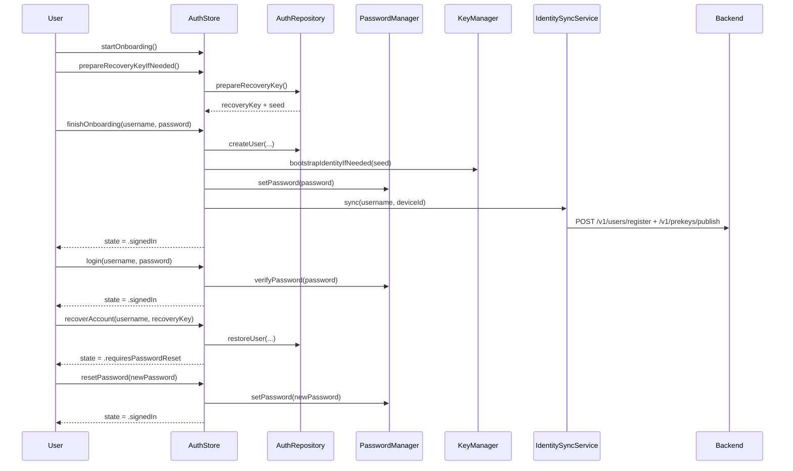
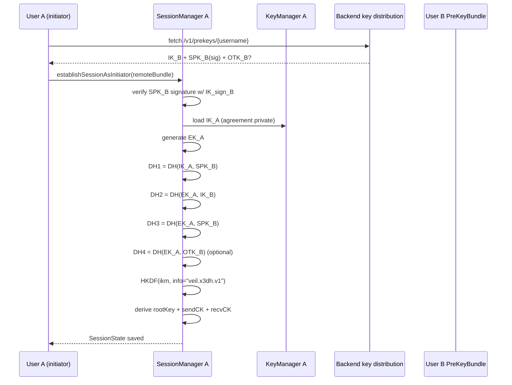
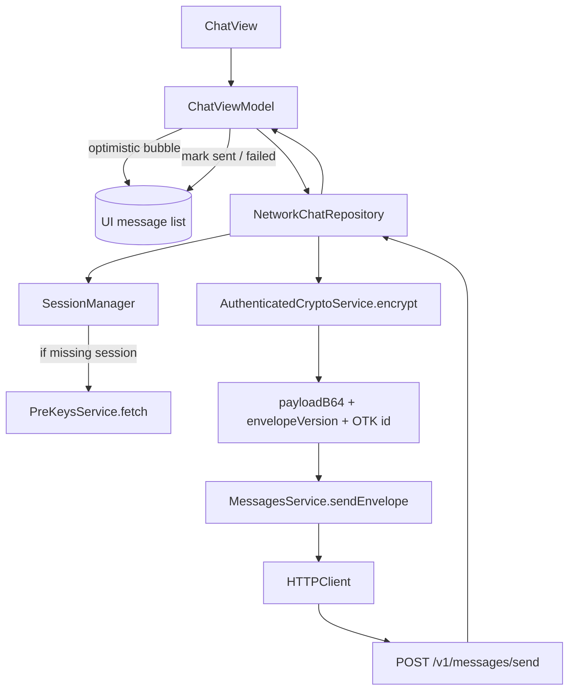
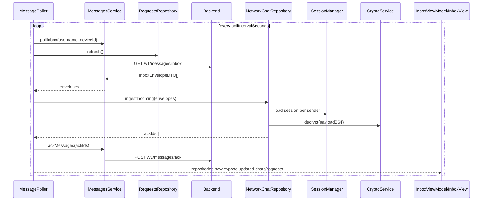
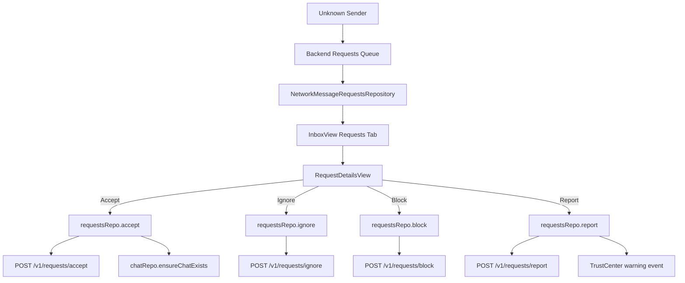
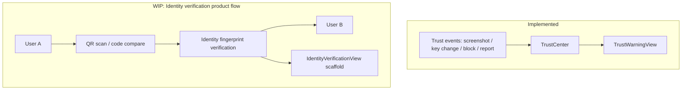
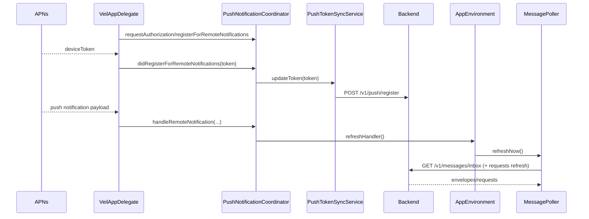
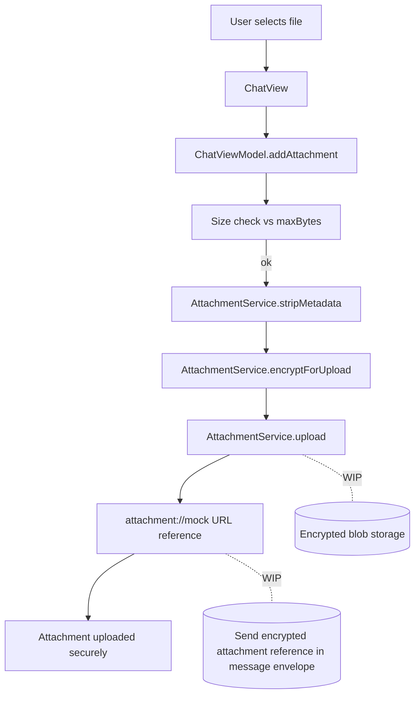
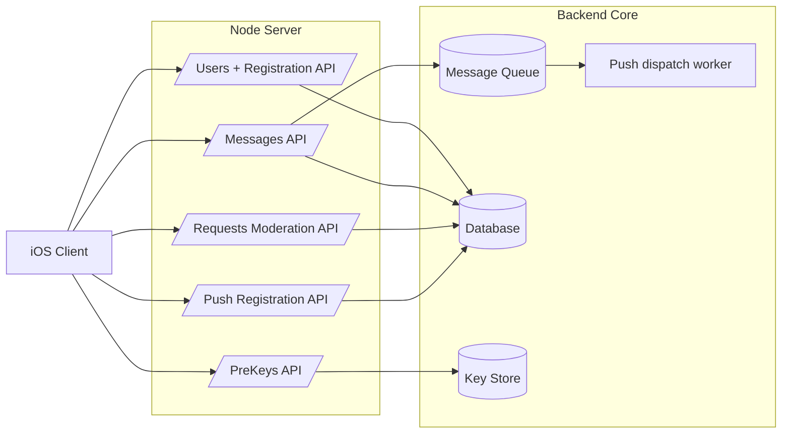
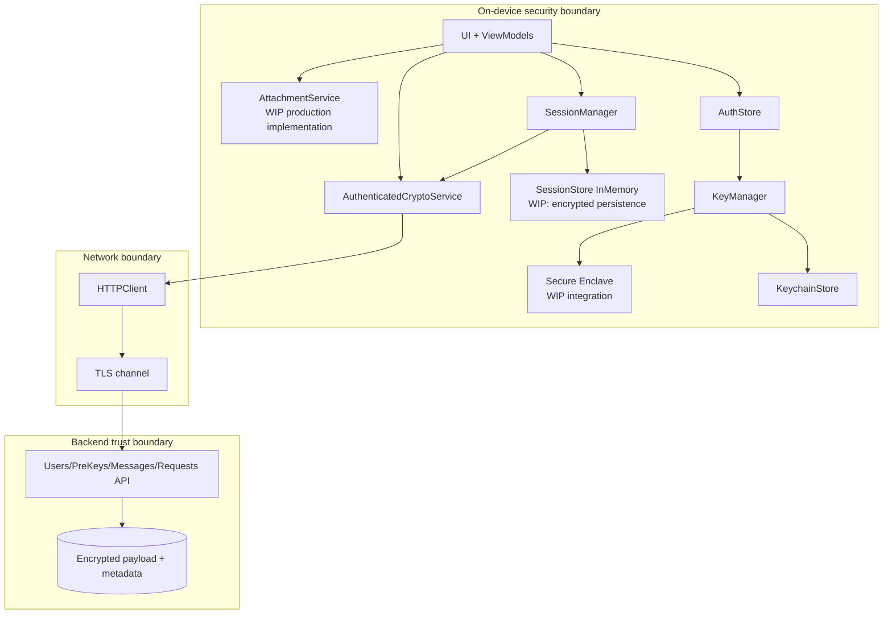

# Veil System Diagrams

This document centralizes architecture and flow diagrams for the Veil iOS app using Mermaid. Diagrams are based on the current repository implementation (SwiftUI app, repository/service networking, X3DH-style session bootstrap, password + recovery auth, polling + push refresh).

---

## 1) High-Level System Architecture

**Description**

This diagram shows the major runtime layers in Veil and their concrete components from the codebase. It reflects the `AppRootView` + `AppEnvironment` composition, repository/service boundaries, cryptographic managers, and backend API dependency.

```mermaid
flowchart TD
  subgraph UI[User Interface Layer]
    AppRoot[AppRootView]
    Screens[Welcome / Username / Recovery / Inbox / Chat]
    VM[ChatViewModel + InboxViewModel + AuthStore]
  end

  subgraph APP[Application Logic Layer]
    Coord[AppCoordinator + AppRoute]
    Env[AppEnvironment]
    Repos[ChatRepository + MessageRequestsRepository + AuthRepository]
    Poller[MessagePoller]
    PushCoord[PushNotificationCoordinator]
  end

  subgraph SEC[Security Layer]
    KM[KeyManager]
    SM[SessionManager]
    Crypto[AuthenticatedCryptoService]
    SessStore[SessionStore (InMemory) \n WIP: persistent encrypted store]
    KCS[KeychainStore]
  end

  subgraph NET[Networking Layer]
    HTTP[HTTPClient]
    UsersSvc[NetworkUsersService]
    PreKeysSvc[NetworkPreKeysService]
    MsgSvc[NetworkMessagesService]
    ReqSvc[NetworkRequestsService]
    PushSvc[NetworkDevicePushTokenService]
  end

  subgraph BE[Backend Services]
    API[Node API Layer]
    KeyDist[PreKey Distribution]
    MsgStore[Message Queue / Store]
    ReqModeration[Request Moderation]
    DB[(Database)]
    KeyStore[(Key Store)]
  end

  AppRoot --> Screens --> VM
  VM --> Coord
  AppRoot --> Env
  Env --> Repos
  Env --> Poller
  Env --> PushCoord

  Repos --> SM
  Repos --> Crypto
  SM --> KM
  SM --> SessStore
  KM --> KCS

  Repos --> HTTP
  Poller --> MsgSvc
  Poller --> ReqSvc
  HTTP --> UsersSvc
  HTTP --> PreKeysSvc
  HTTP --> MsgSvc
  HTTP --> ReqSvc
  HTTP --> PushSvc

  UsersSvc --> API
  PreKeysSvc --> KeyDist
  MsgSvc --> MsgStore
  ReqSvc --> ReqModeration
  PushSvc --> API
  API --> DB
  KeyDist --> KeyStore
```

---

## 2) Navigation Architecture

**Description**

Veil routes through a single `NavigationStack` in `AppRootView`, driven by `AppCoordinator.path` and `AppRoute`. Root content is state-based (`AuthStore.state`), while secondary screens are resolved in `routeView(for:)`.

```mermaid
flowchart TD
  App[VeilApp / AppRootView] --> Nav[NavigationStack(path: coordinator.path)]
  Nav --> Root{AuthStore.state}
  Root -->|signedOut| Welcome[WelcomeView]
  Root -->|onboarding| Username[UsernameCreationView]
  Root -->|requiresPasswordReset| ResetPassword[ResetPasswordView]
  Root -->|signedIn| Inbox[InboxView]

  App --> Coord[AppCoordinator]
  Coord --> Routes[AppRoute enum]
  Routes --> Dest[routeView(for: route)]

  Dest --> Login[LoginView]
  Dest --> Recovery[RecoveryKeyView]
  Dest --> RecoveryLogin[RecoveryLoginView]
  Dest --> Reset[ResetPasswordView]
  Dest --> Chat[ChatView]
  Dest --> RequestDetails[RequestDetailsView]
  Dest --> TrustWarn[TrustWarningView]
```

---

## 3) Authentication + Onboarding Flow

**Description**

The auth model supports password-first sign in with recovery-key fallback. Onboarding generates a recovery seed, bootstraps key material, sets password verifier, and syncs identity/prekeys.



---

## 4) Account Controls: Sign Out vs Remove Account

**Description**

Settings exposes separate controls for ending a session versus destructive local-device wipe.

```mermaid
flowchart TD
  Privacy[PrivacyDashboardView] --> SignOut[Sign Out]
  Privacy --> Erase[Remove Account From Device]

  SignOut --> S1[AuthStore.signOut()]
  S1 --> S2[Clear session flag + volatile auth state]
  S2 --> S3[state = .signedOut]

  Erase --> E1[AuthStore.eraseLocalData()]
  E1 --> E2[LocalDataWiper.wipeAllLocalData()]
  E2 --> E3[authRepo.clear + password clear + key erase + push token clear]
  E3 --> E4[AuthStore.signOut() -> state = .signedOut]
```

---

## 5) X3DH-Style Session Establishment

**Description**

`SessionManager.establishSessionAsInitiator` verifies signed prekeys, performs X25519 DH computations, and derives root/send/receive chain keys. This is currently initiator-side and explicitly “X3DH-style”.



---

## 6) Message Send Pipeline

**Description**

`ChatViewModel.sendMessage` performs optimistic UI update, delegates to repository, and retries once on transient failure. `NetworkChatRepository` ensures a session, encrypts with `CryptoService`, and sends envelope via `MessagesService`.



---

## 7) Message Receive Pipeline (Polling)

**Description**

`MessagePoller` periodically polls inbox and requests in parallel. Incoming envelopes are decrypted via `NetworkChatRepository.ingestIncoming`; successful message IDs are acknowledged to backend.



---

## 8) Message Requests Flow (Abuse-Resistant)

**Description**

Unknown/first-contact traffic is represented as request threads. User actions in `RequestDetailsView` call `MessageRequestsRepository` APIs for accept/ignore/block/report.



---

## 9) PreKey Management Lifecycle

**Description**

`PreKeySyncManager` keeps signed prekeys fresh and one-time prekeys above threshold, publishing refreshed bundles when rotation/replenishment occurs.

```mermaid
flowchart TD
  PKM[PreKeySyncManager] --> Auth[LocalAuthContext username/device]
  PKM --> KM[KeyManager]
  KM --> EnsureSPK[ensureSignedPreKey(maxAgeDays)]
  KM --> CountOTK[oneTimePreKeyCount()]
  CountOTK --> Replenish{count < minimum?}
  Replenish -->|yes| EnsureOTK[ensureOneTimePreKeys(targetCount)]
  Replenish -->|no| Skip[No OTK generation]

  EnsureSPK --> Bundle[makePreKeyBundle(oneTimeCount: target)]
  EnsureOTK --> Bundle
  Bundle --> DTO[PublishPreKeysRequestDTO]
  DTO --> PreSvc[PreKeysService.publish]
  PreSvc --> Backend[POST /v1/prekeys/publish]
```

---

## 9) Trust Center Verification Flow (WIP)

**Description**

Trust event plumbing exists (`TrustCenter`, warning routing), while full fingerprint/QR verification UX is still scaffolded (`IdentityVerificationView`).



---

## 10) Polling + Push Hybrid Delivery

**Description**

Push notifications are used as a wake-up signal; actual message retrieval still occurs through poll/refresh endpoints. APNs token registration is synced after sign-in.



---

## 11) Attachment Encryption Pipeline (WIP)

**Description**

Attachments are currently mock-first. `ChatViewModel.addAttachment` calls `AttachmentService.stripMetadata`, `encryptForUpload`, then `upload`. The default implementation (`MockAttachmentService`) is stubbed and returns mock URLs.



---

## 12) Backend Architecture Expected by iOS App

**Description**

This backend view is inferred from client DTOs/services and API contract documentation.



---

## 13) Security Architecture and Cryptographic Boundaries

**Description**

This diagram shows local secret boundaries, session/key derivation components, and transport boundary. Secure Enclave-backed key generation is not yet implemented and remains WIP.


